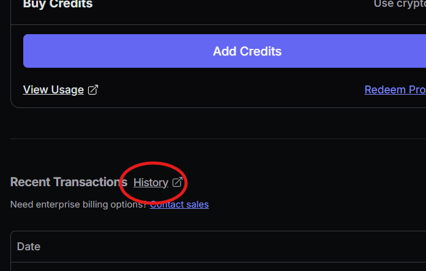
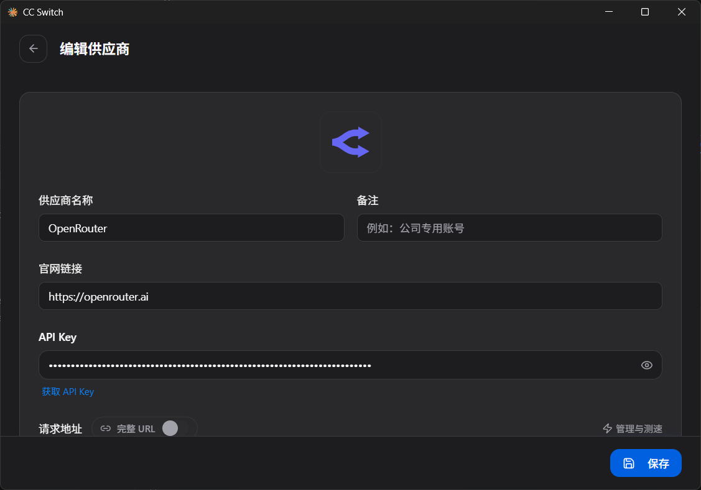
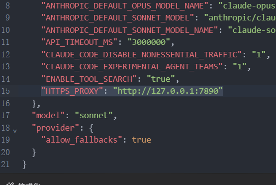

### OpenRouter 注册
~~这个我就不说了 一般不是三岁都会~~

邮箱不建议使用 qq 邮箱 (不知道没试过)

### 配置账单及地址
* 生成地址
  去类似 [US Address Gen](https://usaddressgen.com/) 的网站生成一张随机地址

* 填写 Billing
  如果还没有填写直接在注册时填写地址

  已经填写过 Billing 的如下操作
  1. 前往 [Credits](https://openrouter.ai/settings/credits) 打开 **"History"**
   
  2. 在弹出 billing.stripe.com 的页面中 选择 **"更新信息"**
  3. 将 **生成地址** 的地址填入
  4. 返回 [openrouter.ai](https://openrouter.ai/)

注: 若地址为中国地址(包括香港 台湾)会提示
> "Your billing address is in a region that does not have access to models from OpenAI, Anthropic, and Google. All other models remain available."

### Claude Code 配置
推荐使用 [cc-switch](https://github.com/farion1231/cc-switch)
#### env 配置
神秘 Claude Code 不走 Clash 代理 需要手动添加代理

这里以 `cc-switch` 为例
1. 打开 OpenRouter 的配置详情页
   
2. 在 `配置JSON` 中的 `env`中添加 `"HTTPS_PROXY": "http://127.0.0.1:7890"`
   
   这里的 `"HTTPS_PROXY": "http://127.0.0.1:7890"` 因人而异 反正我的猫是这样

**代理节点一定要去 [IP Pure](https://ippure.com/) 测一遍 纯净度低的风险大**