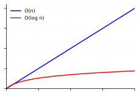
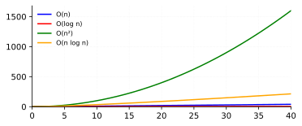

> Translated from Chinese by an LLM.

~~I never know what to write for each chapter - at a loss for words.~~
### Binary Search
The complexity of binary search is \(O(\log n)\).<br>As shown:

<br>
To make it clearer, I compared it with linear search \(O(n)\). It's easy to see the time difference is enormous.

Code implementation:
```cpp
lower_bound();
upper_bound(); // STL
```

### Big O Notation
~~A later chapter also covers this.~~

#### Comparison of time complexities:

The differences between time complexities are huge (I didn't include \(O(n!)\) - its growth rate is so large it would dwarf everything else).<br>
\(c\) is the constant factor of the time an algorithm needs. The actual running time is \(O(x)*c\), where \(x\) stands for any variable.<br>
But in general, the time contributed by \(c\) is not counted, even if it is very large. ~~because the growth rate matters more.~~

Computation: with recursion, it is generally \(O(\text{call stack height}) * O(\text{time per level})\).
### Worst Case vs. Average Case


### Traveling Salesman Problem
[P1433 Eating Cheese](https://www.luogu.com.cn/problem/P1433)
A classic traveling salesman problem (I don't know how to solve it yet).
