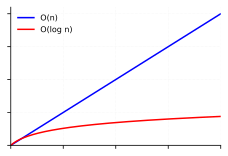

~~每一章都不知道说啥 词穷了~~
## 二分查找
二分查找的复杂度是 \(O(\log n)\) <br>如图:

<br>
我为了更明显 把普通查找 \(O(n)\)做了对比 不难发现 两者所需时间相差极大

代码实现:
```c++
lower_bound();
upper_bound(); // STL
```

## 大O表示法
~~后面一章也写道这了~~

### 各个时间复杂度比对:

各个时间复杂度差距巨大 (没加/(O(n!)/) 这个增长率太大 加上全没了)<br>
\(c\)是算法所需时间的固定量 算法真实运行时间其实是 \(O(x)*c\) 其中\(x\)代指任何<br>
但在一般情况下 不统计\(c\)所需时间 即便他非常大 ~~因为增长的更快·~~

计算: 在有递归的情况下 一般是\(O(调用栈高度) * O(每层所需时间)\)
## 最坏情况与平均情况


## 旅行商问题
[P1433 吃奶酪](https://www.luogu.com.cn/problem/P1433)
典型的旅行商问题 (不会写)
