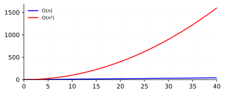

> Translated from Chinese by an LLM.

### Memory
An array occupies contiguous space; each access reads `base address + index`, so the complexity is \(O(1)\). 
A linked list occupies non-contiguous space; each access follows the `next address`, so the complexity is \(O(n)\). 
Comparison table for insert, delete, update, and query:

| Operation | Array | Linked List |
| :---: | :---: | :---: |
| Insert | \(O(n)\) | \(O(1)\) |
| Delete | \(O(n)\) | \(O(1)\) |
| Update | \(O(1)\) | \(O(n)\) |
| Query | \(O(1)\) | \(O(n)\) |

### Selection Sort
Selection sort has the same complexity as bubble sort: \(O(n^2)\). ~~Painfully slow.~~ 
As shown:
 
The principle is to pick the smallest (or largest) element each time and place it in order until sorted.
