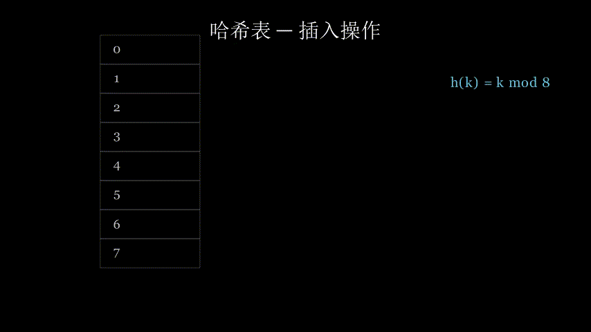
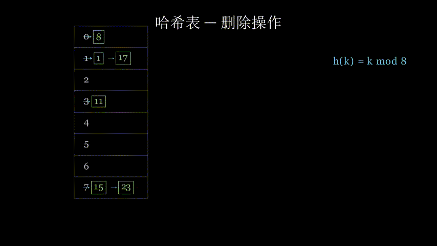
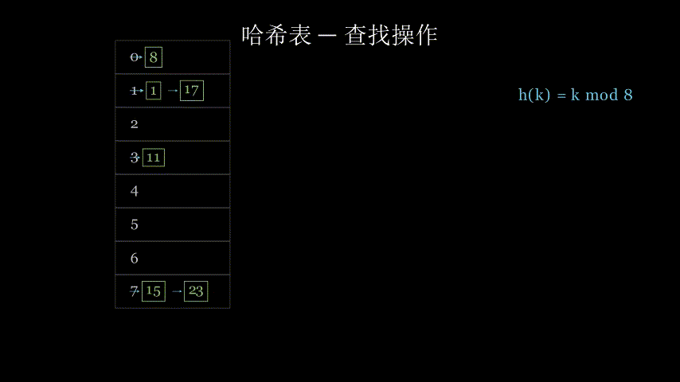
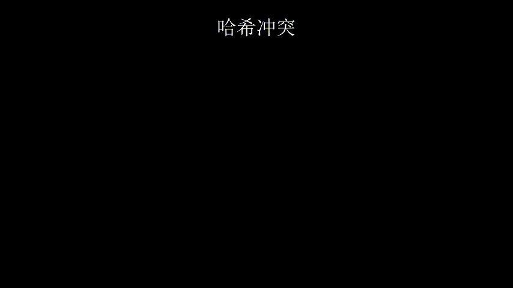

### 〇、前置知识

- **必备前置**：「数组/`vector`」「时间复杂度分析」
- **强相关前置**：「`Hash` 函数」

---

### 一、基本概念

- **定义**：
  又称`散列表` 一种使用键值的形式存储数据的结构
  
- **解决什么问题**：
  增删改查速度过慢 哈希表可以实现近乎$O(1)$的时间复杂度 
- **核心思想**：
  用空间换时间
- **关键名词**：
  负载因子： $\text{负载因子}=\frac{\text{元素数量}}{\text{容器数量}}$
  扩容：当 $\text{元素数量} > \text{负载因子} * \text{容器数量}$ 时 增大容器数量

---

### 二、算法流程 / 原理推导

1. **第一步**：在内存中建立起一大块连续空间
2. **第二步**：输入一个 `key` 将其进行 `hash`
3. **第三步**：按照 `hash` 查看内存 读或写入值
4. **第四步**：检查`容器数`与`元素数` 若超过阈值则进行`扩容`

**为什么这样是对的**：

- 任何一个 `key` 都有唯一的 `hash`

**图示 / 手算样例**：

**插入**

**删除**

**查找**

**处理冲突**


---

### 三、复杂度分析

**理想状态**

| 复杂度 | 最好 | 平均 | 最坏 |
|--------|------|------|------|
| 时间   | $O(1)$ | $O(1)$ | $O(1)$ |
| 空间   | $O(n)$ | $O(n)$ | $O(n)$ |

- **复杂度怎么来的**：
  $$
  \begin{matrix}
    f(hash(key)) = value
  \end{matrix}
  $$
- **能过的数据范围**：受内存大小限制

---

### 四、适用场景

- **适合的问题类型**：化简计算 大量增删改查
- **数据范围**：无范围
- **不能用 / 失效的情况**：内存不足 ~~一般不会~~

---

### 五、代码模板

```cpp
#include <bits/stdc++.h>
using namespace std;

int main() {
    ios_base::sync_with_stdio(false);
    cin.tie(nullptr);
    
    unordered_map<int,int> _map;

    return 0;
}
```

---

### 六、关键点 & 注意事项

1. **边界条件**：
   无边界条件
2. **常见坑点**：
   没有手写过 等手写的时候吧
3. **优化技巧**：
   这个就是优化的技巧了 部分题可以使用 `unordered_map` 优化
4. **易混淆点**：
   `map` 基于`红黑树`实现
   `unordered_map` 基于`哈希表`实现

---

### 七、例题

| 题目 | 来源 | 难度 | 链接 |
|------|------|------|------|
| 【模板】哈希表 | Luogu | 橙 | [P11615](https://www.luogu.com.cn/problem/P11615) |

**P11615**：
- 题意：
  快读输入数 将其存入 `哈希表` 中 部分数存在同余关系 会 `TLE`
- 思路：
  手写`哈希表` 对`哈希表`进行大量增删改查 由于同余关系 导致需要双射或手写`哈希表`
  ``` cpp
  char buf[1 << 23], *p1 = buf, *p2 = buf;
  #define gc() (p1==p2&&(p2=(p1=buf)+fread(buf,1,1<<21,stdin),p1==p2)?EOF:*p1++)

  inline void rd(ull &x) { // 读入一个 64 位无符号整数
      x = 0;
      char ch = gc();
      while (!isdigit(ch))
          ch = gc();
      while (isdigit(ch))
          x = x * 10 + (ch ^ 48), ch = gc();
  }
  

  // Bro 的阴招 可以使用此函数来进行双射和打破同余关系
  inline void fuck_rd(ull &x) {
      x = 0;
      ull len = 1;
      bool flag = false;
      char ch = gc();
      while (!isdigit(ch))
          ch = gc();
      while (isdigit(ch)){
          int cur = (ch ^ 48);   
          if(cur){
              x += len * (ch ^ 48);
              ch = gc();
              if(flag) x -= len/10;
              len *= 10;
              flag = false;
          }else{
              x += len;
              ch = gc();
              if(flag) x -= len/10;
              len *= 10;
              flag = true;
          }
      }
      x += len; // x += len * (正整数) 可以避免双射被逆向后大量碰撞
      if(flag) x -= len/10;
  }
    
  ```
- 坑点：**存在大量具有同余关系的数字 导致** `unordered_map` **退化到** $O(n)$

---

### 八、相关算法 / 扩展

- **一句话总结**：$O(1)$ 增删改查