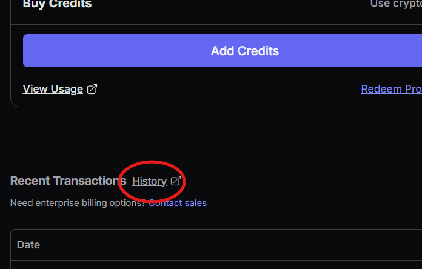
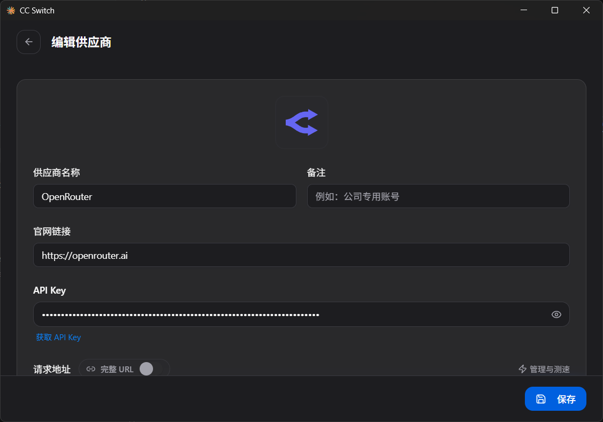
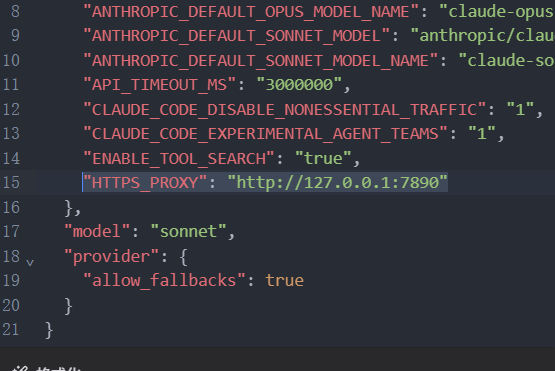

> Translated from Chinese by an LLM.

### OpenRouter Registration
~~I won't cover this - isn't it something even a three-year-old can do?~~

Using a QQ email address is not recommended (not sure, haven't tried).

### Configuring Billing and Address
* Generate an address
  Go to a site like [US Address Gen](https://usaddressgen.com/) to generate a random address.

* Fill in Billing
  If you haven't filled it in yet, enter the address during registration.

  If you have already filled in Billing, do the following:
  1. Go to [Credits](https://openrouter.ai/settings/credits) and open **"History"**.
   
  2. On the billing.stripe.com page that pops up, select **"Update information"**.
  3. Fill in the address from **Generate an address**.
  4. Return to [openrouter.ai](https://openrouter.ai/).

Note: If the address is a Chinese address (including Hong Kong, Taiwan), you will see:
> "Your billing address is in a region that does not have access to models from OpenAI, Anthropic, and Google. All other models remain available."

### Claude Code Configuration
[cc-switch](https://github.com/farion1231/cc-switch) is recommended.
#### env Configuration
For some reason Claude Code doesn't go through the Clash proxy - you need to add the proxy manually.

Here using `cc-switch` as an example:
1. Open the OpenRouter configuration details page.
   
2. In the `Configuration JSON`, under `env`, add `"HTTPS_PROXY": "http://127.0.0.1:7890"`.
   
   The value of `"HTTPS_PROXY": "http://127.0.0.1:7890"` varies by person - anyway, that's how my cat is set up.

**Be sure to test your proxy node on [IP Pure](https://ippure.com/) - low purity means high risk.**
